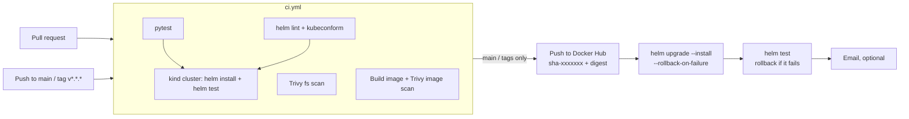

# Flask App with MySQL Docker Setup

A small two-tier app: a Flask web app that stores messages in MySQL. Submit a message in the form; it is saved in the database and listed on the page.

Stack: Python 3.13, Flask 3.1, gunicorn, PyMySQL, MySQL 8.4.

| Route | What it does |
|---|---|
| `GET /` | Lists all messages and shows which server answered |
| `POST /submit` | Saves `new_message` (form field), returns it as JSON |
| `GET /health` | Returns `{"status":"ok"}` (no database call), used by health checks |

## Prerequisites

- Docker with the Compose plugin (`docker compose`)
- Git (optional, for cloning the repository)

## Run with Docker Compose

1. Clone and enter the repo:

   ```bash
   git clone https://github.com/LondheShubham153/two-tier-flask-app.git
   cd two-tier-flask-app
   ```

2. (Optional) set your own database credentials. Without a `.env` file the defaults in `docker-compose.yml` are used.

   ```bash
   cp .env.example .env   # then edit the passwords
   ```

3. Start everything:

   ```bash
   docker compose up --build
   ```

4. Open http://localhost:5000, send a few messages. The `messages` table is created automatically.

   > On macOS, port 5000 may already be used by *AirPlay Receiver*. Turn it off in System Settings, or change the left side of `"5000:5000"` in `docker-compose.yml`.

5. Stop and remove the containers (`-v` also deletes the database volume):

   ```bash
   docker compose down        # keep data
   docker compose down -v     # delete data too
   ```

`make build`, `make run`, `make stop`, `make test` and `make clean` are shortcuts for the common commands.

## Run without Docker Compose

1. Build the image and create a network:

   ```bash
   docker build -t flaskapp .
   docker network create twotier
   ```

2. Start MySQL:

   ```bash
   docker run -d \
       --name mysql \
       -v mysql-data:/var/lib/mysql \
       --network=twotier \
       -e MYSQL_DATABASE=mydb \
       -e MYSQL_ROOT_PASSWORD=admin \
       -p 3306:3306 \
       mysql:8.4
   ```

3. Start the app (wait a few seconds for MySQL to be ready first):

   ```bash
   docker run -d \
       --name flaskapp \
       --network=twotier \
       -e MYSQL_HOST=mysql \
       -e MYSQL_USER=root \
       -e MYSQL_PASSWORD=admin \
       -e MYSQL_DB=mydb \
       -p 5000:5000 \
       flaskapp:latest
   ```

## Configuration

The app reads its database settings from environment variables:

| Variable | Default |
|---|---|
| `MYSQL_HOST` | `localhost` |
| `MYSQL_PORT` | `3306` |
| `MYSQL_USER` | `default_user` |
| `MYSQL_PASSWORD` | `default_password` |
| `MYSQL_DB` | `default_db` |
| `FLASK_DEBUG` | off (`1` enables debug when running `python app.py`) |

## Tests

```bash
pip install -r requirements-dev.txt
pytest
```

## CI/CD with GitHub Actions + Helm

Think of it as a factory line: **CI** is the quality inspector (tests, scans, a trial install on a throwaway cluster), **CD** is the delivery truck (push the image, install it on the real cluster), and the **Helm chart** is the flat-pack instruction sheet that fits any house (kubeadm or EKS) by swapping one values file.



### Jenkins stage → GitHub Actions

| Jenkinsfile | GitHub Actions |
|---|---|
| `agent { label "dev" }` | `runs-on: ubuntu-latest` (use `[self-hosted, dev]` if the cluster is only reachable from your network) |
| Code Clone | `actions/checkout` |
| Trivy File System Scan | `ci.yml` → `trivy-fs` (fails on fixable HIGH/CRITICAL) |
| Build | `ci.yml` → `image-scan` (Buildx, GHA layer cache, Trivy image scan) |
| Test | `ci.yml` → `unit-tests` (pytest) + `e2e-kind` (real MySQL on kind, `helm test`) |
| Push to Docker Hub | `cd.yml` → `build-push` (tags `sha-<commit>`, branch, semver, `latest`; SBOM + provenance) |
| Deploy (`docker compose up`) | `cd.yml` → `deploy` (`helm upgrade --install` to Kubernetes) |
| `post { emailext }` | `cd.yml` → `notify` (only if `NOTIFY_EMAIL` is set) |

### One-time setup

Repo **Settings → Secrets and variables → Actions**. You can also put them on the `production` environment (Settings → Environments), where you can add *Required reviewers* for a manual approval before every deploy.

| Name | Kind | Needed for | Value |
|---|---|---|---|
| `DOCKERHUB_USERNAME` | Variable | always | Docker Hub user/org. Image becomes `docker.io/<user>/two-tier-flask-app` |
| `DOCKERHUB_TOKEN` | Secret | always | Docker Hub access token (Read & Write) |
| `CLUSTER_TYPE` | Variable | optional | `eks` (default) or `kubeconfig` |
| `HELM_VALUES_FILE` | Variable | optional | `values-eks.yaml` (default) or `values-kubeadm.yaml` |
| `AWS_ROLE_ARN` | Variable | EKS | IAM role GitHub assumes via OIDC (no AWS keys stored) |
| `AWS_REGION` | Variable | EKS | e.g. `eu-west-1` |
| `EKS_CLUSTER_NAME` | Variable | EKS | Cluster name |
| `KUBE_CONFIG` | Secret | kubeconfig | Full kubeconfig file content (kubeadm, k3s, any cluster) |
| `K8S_NAMESPACE` | Variable | optional | Default `two-tier` |
| `HELM_RELEASE` | Variable | optional | Default `two-tier-flask-app` |
| `MYSQL_PASSWORD`, `MYSQL_ROOT_PASSWORD` | Secret | optional | Your own DB passwords. If unset, the chart generates random ones and keeps them across upgrades |
| `NOTIFY_EMAIL`, `SMTP_PORT` | Variable | optional | Recipient(s); SMTP port (default 465) |
| `SMTP_SERVER`, `SMTP_USERNAME`, `SMTP_PASSWORD` | Secret | optional | SMTP account used to send the email |

> Decide on `MYSQL_PASSWORD`/`MYSQL_ROOT_PASSWORD` **before the first deploy**. MySQL stores the password on its volume at first boot; changing the secret later does not change the database password.

**EKS: let GitHub assume an IAM role (OIDC)**

```bash
ACCOUNT_ID=$(aws sts get-caller-identity --query Account --output text)
REPO="<github-owner>/<repo>"            # e.g. chandu/two-tier-flask-app
CLUSTER="<eks-cluster-name>"

# 1. GitHub OIDC provider (once per AWS account)
aws iam create-open-id-connect-provider \
  --url https://token.actions.githubusercontent.com \
  --client-id-list sts.amazonaws.com

# 2. Role that only this repo's "production" environment can assume
cat > trust.json <<EOF
{
  "Version": "2012-10-17",
  "Statement": [{
    "Effect": "Allow",
    "Principal": { "Federated": "arn:aws:iam::${ACCOUNT_ID}:oidc-provider/token.actions.githubusercontent.com" },
    "Action": "sts:AssumeRoleWithWebIdentity",
    "Condition": {
      "StringEquals": {
        "token.actions.githubusercontent.com:aud": "sts.amazonaws.com",
        "token.actions.githubusercontent.com:sub": "repo:${REPO}:environment:production"
      }
    }
  }]
}
EOF
aws iam create-role --role-name gha-two-tier-deploy --assume-role-policy-document file://trust.json
aws iam put-role-policy --role-name gha-two-tier-deploy --policy-name eks-describe \
  --policy-document "{\"Version\":\"2012-10-17\",\"Statement\":[{\"Effect\":\"Allow\",\"Action\":\"eks:DescribeCluster\",\"Resource\":\"arn:aws:eks:*:${ACCOUNT_ID}:cluster/${CLUSTER}\"}]}"

# 3. Give the role access inside the cluster (EKS access entries)
ROLE_ARN=arn:aws:iam::${ACCOUNT_ID}:role/gha-two-tier-deploy
aws eks create-access-entry --cluster-name "$CLUSTER" --principal-arn "$ROLE_ARN"
aws eks associate-access-policy --cluster-name "$CLUSTER" --principal-arn "$ROLE_ARN" \
  --policy-arn arn:aws:eks::aws:cluster-access-policy/AmazonEKSClusterAdminPolicy \
  --access-scope type=cluster
```

EKS also needs the **Amazon EBS CSI driver** add-on for the MySQL volume. `values-eks.yaml` turns on a NetworkPolicy (MySQL reachable only from the Flask pods); it is enforced once the VPC CNI add-on has `enableNetworkPolicy: "true"`.

**kubeadm (or any other cluster):** set `CLUSTER_TYPE=kubeconfig`, `HELM_VALUES_FILE=values-kubeadm.yaml`, and paste the kubeconfig into the `KUBE_CONFIG` secret. GitHub-hosted runners must be able to reach the API server; for a private cluster, run the deploy job on a self-hosted runner.

### Deploy by hand with Helm

```bash
# kubeadm cluster -> http://<node-ip>:30004
helm upgrade --install two-tier-flask-app helm/two-tier-flask-app \
  -n two-tier --create-namespace -f helm/two-tier-flask-app/values-kubeadm.yaml

# Amazon EKS -> LoadBalancer hostname
helm upgrade --install two-tier-flask-app helm/two-tier-flask-app \
  -n two-tier --create-namespace -f helm/two-tier-flask-app/values-eks.yaml \
  --set image.repository=docker.io/<user>/two-tier-flask-app --set image.tag=sha-<commit>

helm test two-tier-flask-app -n two-tier --logs      # smoke test
helm history two-tier-flask-app -n two-tier          # revisions
helm rollback two-tier-flask-app -n two-tier         # back to the previous revision
helm uninstall two-tier-flask-app -n two-tier        # the MySQL PVC and its Secret are kept on purpose
```

Commands use Helm 4 (`--rollback-on-failure` replaced Helm 3's `--atomic`). Every setting is documented in [`helm/two-tier-flask-app/values.yaml`](helm/two-tier-flask-app/values.yaml), including using Amazon RDS instead of in-cluster MySQL (`mysql.enabled=false` + `externalDatabase.host`).

### What the chart deploys

| Object | Notes |
|---|---|
| Deployment (Flask, 2 replicas) | Non-root UID 10001, read-only root FS, all capabilities dropped; `wait-for-db` init container; probes on `/health` |
| StatefulSet (MySQL 8.4) | PVC via `volumeClaimTemplates`; startup/readiness/liveness via `mysqladmin ping`; init SQL from a ConfigMap |
| Services | Flask: ClusterIP / NodePort 30004 / LoadBalancer per overlay. MySQL: ClusterIP + headless |
| Secret | DB passwords: generated once and reused (`lookup`), or your own via `mysql.auth.existingSecret` |
| Optional | Ingress, HPA, PodDisruptionBudget, NetworkPolicy, hostPath PV (kubeadm) |
| `helm test` pod | `/health`, `GET /` (reads MySQL); in CI also writes a message and reads it back |

## What's in the repo

| Path | Purpose |
|---|---|
| `Dockerfile`, `Dockerfile-multistage` | Container images (the second shows the multi-stage pattern) |
| `docker-compose.yml`, `Makefile` | Local run |
| `.github/workflows/ci.yml` | CI: pytest, Trivy, Helm lint/kubeconform, image scan, kind end-to-end test |
| `.github/workflows/cd.yml` | CD: push image to Docker Hub, `helm upgrade --install`, `helm test` |
| `.github/dependabot.yml` | Weekly updates for actions, pip and the base image |
| `helm/two-tier-flask-app/` | Helm chart (Flask Deployment + MySQL StatefulSet) with kubeadm / EKS / CI overlays |
| **`aws/`** | **Step-by-step guide to run this app on AWS: VPC, EC2, RDS, ALB, Auto Scaling, CloudWatch** |

## Notes

- This is a demo setup. For production use real secrets management, TLS and backups.
- If something fails, check `docker compose logs`.
